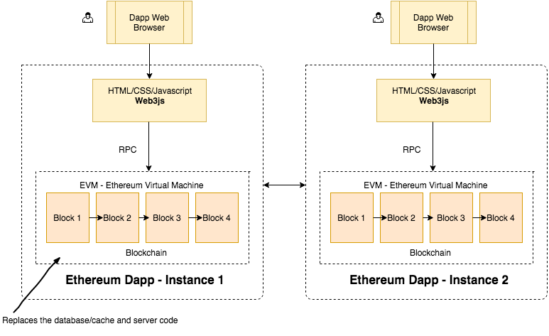

# Microsoft Codefundo Competititon 2019
Aadhaar Based voting system using blockchain technology
Project implemented as part Microsoft Codefundo Competititon

## Information


If you notice, every client (browser) communicates with it’s own instance of the application. There is no central server to which all clients connect to. This means, every person who wants to interact with a dapp (Decentralized Application) will need a full copy of the blockchain running on their computer/phone etc. That means, before you can use an application, you have to download the entire blockchain and then start using the application. This might sound ridiculous at first but it has the advantage of not relying on a single central server which might disappear tomorrow.


Now, what exactly is this blockchain? It has:
1. **Database** : Every few transactions that occur in the Ethereum network are packaged in to blocks and each block is linked to the next block. This linked series of blocks which holds all the transaction data is the blockchain. If we go back to the eBay example, every transaction between buyers and sellers, whether it is a sale, refund or dispute would all be recorded on the blockchain and is available for everyone to see. To make sure all the nodes in the network have same copy of the data and to insure no invalid data gets written to this database, Ethereum uses an algorithm called Proof of Work (http://ethereum.stackexchange.com/questions/14/what-proof-of-work-function-does-ethereum-use)
2. **Code** : The database aspect of blockchain just stores the data. But where is all the logic to buy, sell, cancel, refund etc. In Ethereum world, you write the application code (called contract) in a language called Solidity. You then use the solidity compiler to compile it to Ethereum Byte Code and then deploy that byte code to the blockchain. There are few other alternates to Solidity but Solidity is by far the most popular language for contract development.


## Description of the Project

* The authority must login first with the provided session ID. For now I have just created one admin with unique username and password.
* The voter can now begin the process of voting with proper authentication through OTP(one time password) on the respective linked mobile number.
* If the voter is valid then the system will check for for the voters age and the address to which he can give vote.
* the voting pallete will be opned with  candidate names,their parties and logos.
* Now the voter can give his vote by clicking vote button.
* one voter can give his vote only once,i.e after one time voting buttons are disabled and the vote is automatically loged out.
* Same process continiues for many more votters irrespective of their voting wards.
* The front end involves Html and the backend is done in Nodejs and Firebase. The blockchain ethereum services used is ganache-cli. I haven't used any truffle framework.

### Installing and Running Project

Clone Project
```
git clone https://github.com/raghavaggarwal99/Blockchain.git && cd Blockchain
```
Install Dependencies
```
npm install
```
Running Project
```
node index.js
```
If dependency problem occurs delete package.json, Run
```
npm init
```
Again Install dependencies and run project.


### Running Project
Step 1 - Setting up Environment
Instead of developing the app against the live Ethereum blockchain, we have used an in-memory blockchain (think of it as a blockchain simulator) called testrpc.

```
npm install ethereumjs-testrpc web3
```

Step 2 - Creating Voting Smart Contract

```
npm install solc
```
Step3- Setting connection with ethereum Blockchain services

This will list out the 10 accounts that are given in free in ganache-cli
```
node_modules/.bin/ganache-cli
```
Here you can see, I am displaying the accounts at 3 places. All are same. First is the above written command. 2nd and 3rd is when i set up my connection with ganache-cli in browser and node terminal respectively


Step 4- Compiling the contract

```
npm install solc@0.6.4
node_modules/.bin/solcjs --bin --abi Voting.sol
ls
Voting.sol              Voting_sol_Voting.abi   Voting_sol_Voting.bin

```

When you compile the code successfully using the command above, the compiler outputs 2 files that are important to understand:
1. **Voting_sol_Voting.bin** : This is the bytecode you get when the source code in Voting.sol is compiled. This is the code which will be deployed to the blockchain.
2. **Voting_sol_Voting.abi** : This is an interface or template of the contract (called abi) which tells the contract user what methods are available in the contract. Whenever you have to interact with the contract in the future, you will need this abi definition. You can read more details about ABI here

Step 5 - Testing in node console

Not required just for testing in node console-
After writing our smart contract, we'll use Web3js to deploy our app and interact with it
```
$ node
> Web3 = require('web3')
> web3 = new Web3(new Web3.providers.HttpProvider("http://localhost:8545"));
Then ensure Web3js is initalized and can query all accounts on the blockchain

> web3.eth.accounts
Lastly, compile the contract by loading the code from Voting.sol in to a string variable and compiling it

> bytecode = fs.readFileSync('Voting_sol_Voting.bin').toString()
> abi = JSON.parse(fs.readFileSync('Voting_sol_Voting.abi').toString())
> deployedContract = new web3.eth.Contract(abi)
> listOfCandidates = ['Sanat', 'Aniket', 'Mandar', 'Akshay']
> deployedContract.deploy({
  data: bytecode,
  arguments: [listOfCandidates.map(name => web3.utils.asciiToHex(name))]
}).send({
  from: 'ENTER 1 OF 10 ACCOUNT ADDRESSES like 0xfb3....',
  gas: 1500000,
  gasPrice: web3.utils.toWei('0.00003', 'ether')
}).then((newContractInstance) => {
  deployedContract.options.address = newContractInstance.options.address
  console.log(newContractInstance.options.address)
});

```

Step 6 - Interacting with the Contract via the Nodejs Console

```
> deployedContract.methods.totalVotesFor(web3.utils.asciiToHex('Sanat')).call(console.log)
> deployedContract.methods.voteForCandidate(web3.utils.asciiToHex('Sanat')).send({from: 'YOUR ACCOUNT ADDRESS'}).then((f) => console.log(f))
```


### Purpose of test

 * The authority login is to ensure security to prevent piracy,harresment and corruption from candidates standing in election.
 * OTP generation is to authenticate the right aadhar card owner.
 * button disabling and automatic logout is to prevent multiple voting by single candidate. 

## Screen1
1. The first screen involves the admin login


## Screen2
2. The second screen involves aadhar login of users. With a unique otm send to your phone with the help of firebase


## Screen3
After you submit the otp and it matches with the firebase, it taked you to the voring page.


## Screen4

After submitting one vote, the sesion will automotically logged out with the pop up showing that you have voted for this candidate.


## Deployment

The Aadhaar based voting system is developed to overcome the flaws of EVM system. So directly EVM will be replaced by touch screen interface having the great user interface and high security.

## License

This project is licensed under the MIT License - see the [LICENSE](LICENSE) file for details
